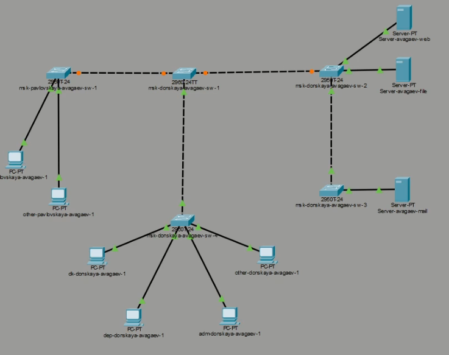
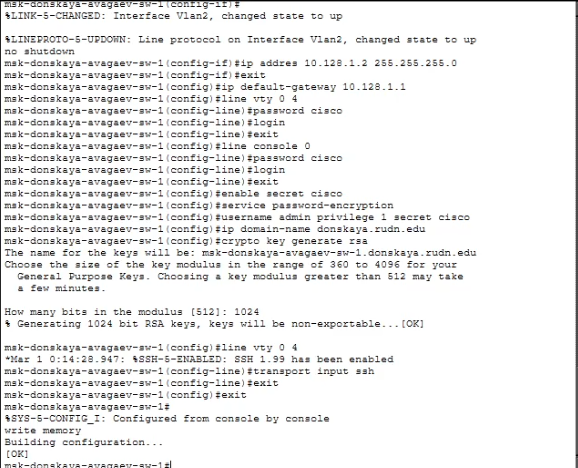
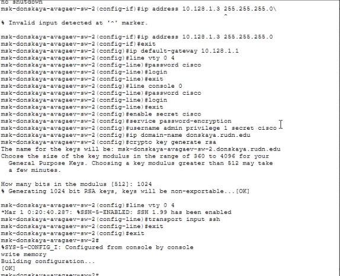
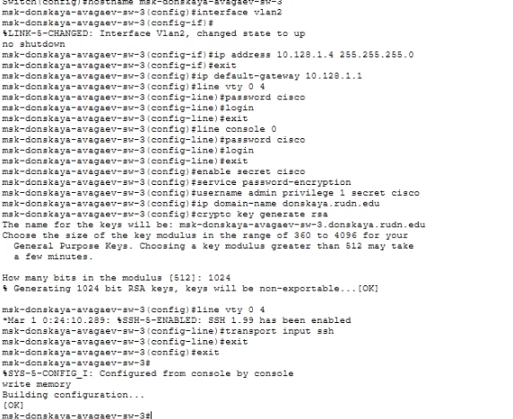
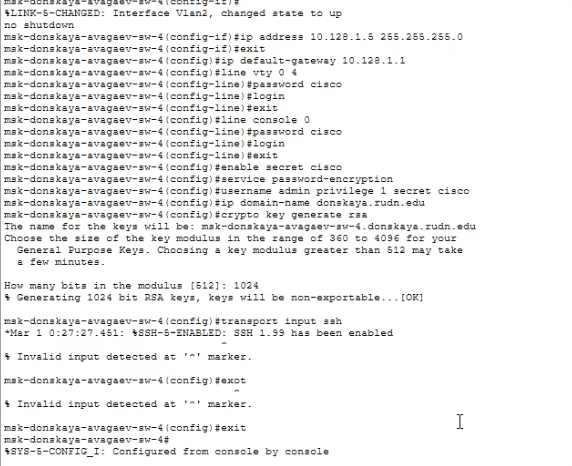
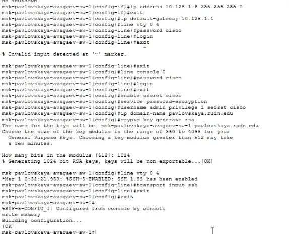

---
## Author
author:
  name: Арсений Валерьевич Агаев
  email: 1032221668@rudn.ru
  affiliation:
    - name: Российский университет дружбы народов
      country: Российская Федерация
      postal-code: 117198
      city: Москва
      address: ул. Миклухо-Маклая, д. 6

## Title
title: "Лабораторная работа №4"
subtitle: "Первоначальное конфигурирование сети"
license: "CC BY"
---

# Цель работы

Провести подготовительную работу по первоначальной настройке коммутаторов сети.

# Задание

Требуется сделать первоначальную настройку коммутаторов сети, представленной на схеме L1.
Под первоначальной настройкой понимается указание имени устройства, его IP-адреса, настройка
доступа по паролю к виртуальным терминалам и консоли, настройка удалённого доступа к устройству по ssh.

# Выполнение лабораторной работы

## Схема сети

Первоначально в логической области Packet Tracer я разместил устройства согласно 
схеме сети ([рис. @fig-001]).

{#fig-001 width=70%}

## Конфигурирование коммутаторов

Через CLI приступил к настройке первого коммутатора ```msk-donskaya-avagaev-sw-1``` ([рис. @fig-002]).

Сначала захожу в режим конфигурирования:

```
enable
configure terminal
```

После указываю корректное имя устройства:

```
hostname msk-donskaya-avagaev-sw-1
```

Затем настраиваю ```vlan``` интерфейс и выдаю IP адрес:

```
interface vlan2
no shutdown
ip address 10.128.1.2 255.255.255.0
exit

ip  default-gateway 10.128.1.1
```

Настраиваю доступ по паролю к виртуальным терминалам:

```
line vty 0 4
password cisco
login
exit
```

К консоли:

```
line console 0
password cisco
login
exit
```

Далее настраиваю шифрование пароля, доменое имя, генерирую ```RSA``` ключ:

```
enable secret cisco
service password-encryption
username admin privilege 1 secret cisco

ip domain-name donskaya.rudn.edu
crypto key generate rsa
```

И наконец включаю доступ по SSH:

```
line vty 0 4
transport input ssh

exit
exit
write memory
```

{#fig-002 width=70%}

Для остальных четырех коммутаторов шаги аналогичные, за исключением IP адреса, который заменяется
на 10.128.1.3-10.128.1.6 соответственно и коммутатору ```msk-pavlovskaya-avagaev-sw-1``` 
присваивается доменое имя ```pavlovskaya.rudn.edu``` 
([рис. @fig-003], [рис. @fig-004], [рис. @fig-005] и [рис. @fig-006]).

{#fig-003 width=70%}

{#fig-004 width=70%}

{#fig-005 width=70%}

{#fig-006 width=70%}

# Выводы

Я провёл подготовительную работу по первоначальной настройке коммутаторов сети.
