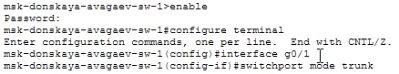
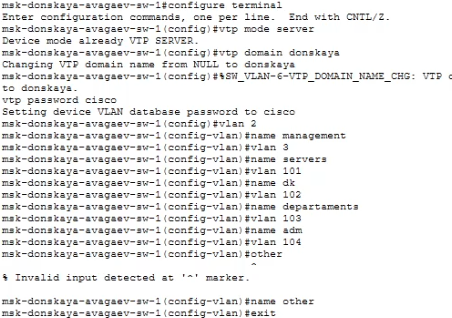
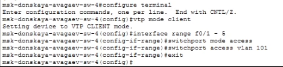
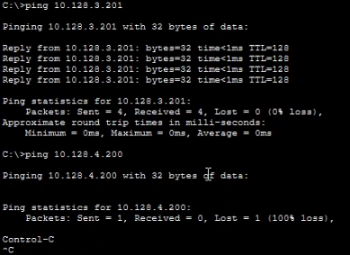

---
## Author
author:
  name: Арсений Валерьевич Агаев
  email: 1032221668@rudn.ru
  affiliation:
    - name: Российский университет дружбы народов
      country: Российская Федерация
      postal-code: 117198
      city: Москва
      address: ул. Миклухо-Маклая, д. 6

## Title
title: Лабораторная работа №5
subtitle: Конфигурирование VLAN
license: CC BY
date: today
date-format: "YYYY-MM-DD" # Example: 2025-09-06
---
# Информация

## Докладчик

:::::::::::::: {.columns align=center}
::: {.column width="70%"}

  * Арсений Валерьевич Агаев
  * студент
  * Российский университет дружбы народов им. П. Лумумбы
  * [1032221668@rudn.ru](mailto:1032221668@rudn.ru)

:::
::: {.column width="30%"}

:::
::::::::::::::

# Цели и задачи

Получить основные навыки по настройке VLAN на коммутаторах сети.

- На коммутаторах сети настроить Trunk-порты на соответствующих интерфейсах (см. табл. 3.2 из раздела 3.3), связывающих коммутаторы между собой.

- Коммутатор msk-donskaya-sw-1 настроить как VTP-сервер и прописать на нём номера и названия VLAN согласно табл. 3.1 из раздела 3.3.

-  Коммутаторы msk-donskaya-sw-2 — msk-donskaya-sw-4, mskpavlovskaya-sw-1 настроить как VTP-клиенты, на интерфейсах указать принадлежность к соответствующему VLAN (см. табл. 3.3 из раздела 3.3).

-  На серверах прописать IP-адреса, как указано в табл. 3.2 из раздела 3.3.

-  На оконечных устройствах указать соответствующий адрес шлюза и прописать статические IP-адреса из диапазона соответствующей сети, следуя регламенту выделения ip-адресов (см. табл. 3.4 из раздела 3.3).

-  Проверить доступность устройств, принадлежащих одному VLAN, и недоступность устройств, принадлежащих разным VLAN.

# Содержание исследования

## Конфигурация Trunk

На всех коммутаторах на портах между самими коммутаторами включаем Trunk ([рис. @fig-001]).

В качестве примера, настройка коммутатора ```msk-donskaya-avagaev-sw-1``` на порту ```g0/1```:

```
enable
conf terminal
interface g0/1
switchport mode trunk
```

## Конфигурация Trunk

{#fig-001 width=70%}

Аналогично до порта настраиваются остальные коммутаторы.

## Конфигурация VTP на ```msk-donskaya-avagaev-sw-1```

Далее настраивается ```msk-donskaya-avagaev-sw-1``` как VTP сервер и прописываются нужные vlan:

```
enable
conf terminal
vtp mode server
vtp domain donskaya
vtp password cisco
vlan 2
name management
vlan 3
name servers
vlan 101
name dk
vlan 102
name departaments
vlan 103
name adm
vlan 104
name other
```

## Конфигурация VTP на ```msk-donskaya-avagaev-sw-1```

{#fig-002 width=70%}

## Конфигурация диапазона портов

Оставшиеся коммутаторы настраиваются как VTP клиенты и указываются принадлежность портов к VLAN.

В качестве примера настройка портов ДК на ```msk-donskaya-avagaev-sw-4```:

```
enable
conf terminal
vtp mode client
vtp password cisco
interface range f0/1 - 5
switchport mode access
switchport access vlan 101
```

## Конфигурация диапазона портов

{#fig-003 width=70%}

Остальные настраиваются аналогично, изменяя только диапазон портов и VLAN на необходимые.

## Проверка доступности

Командой ```ping``` проверил доступность устройств в одной VLAN и недоступность в разных.

```
ping 10.128.3.201

ping 10.128.4.200
```

## Проверка доступности

{#fig-004 width=70%}

# Результаты

Я успешно получил основные навыки по настройке VLAN на коммутаторах сети.
