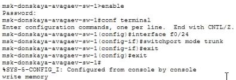
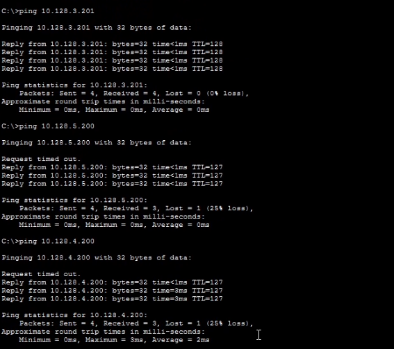

---
## Author
author:
  name: Арсений Валерьевич Агаев
  email: 1032221668@rudn.ru
  affiliation:
    - name: Российский университет дружбы народов
      country: Российская Федерация
      postal-code: 117198
      city: Москва
      address: ул. Миклухо-Маклая, д. 6

## Title
title: Лабораторная работа №6
subtitle: Статическая маршрутизация VLAN
license: CC BY
date: today
date-format: "YYYY-MM-DD" # Example: 2025-09-06
---
# Информация

## Докладчик

:::::::::::::: {.columns align=center}
::: {.column width="70%"}

  * Арсений Валерьевич Агаев
  * студент
  * Российский университет дружбы народов им. П. Лумумбы
  * [1032221668@rudn.ru](mailto:1032221668@rudn.ru)

:::
::: {.column width="30%"}

:::
::::::::::::::

# Цели и задачи

Настроить статическую маршрутизацию VLAN в сети.

- Добавить в локальную сеть маршрутизатор, провести его первоначальную настройку.

- Настроить статическую маршрутизацию VLAN.

# Содержание исследования

## Размещение маршрутизатора

Вначале я разметил маршрутизатор Cisco 2811 и подключил его к 
```msk-donskaya-avagaev-sw-1``` к порту 24 ([рис. @fig-001]).

{#fig-001 width=70%}

## Первоначальная настройка марштуризатора

Последовательностью команд далее, выполнил первичную настойку маршрутизатора:

```
enable
configure terminal
hostname msk-donskaya-avagaev-gw-1

line vty 0 4
password cisco
login

line console 0
password cisco
login

enable secret cisco
service password-encryption

username admin privilege 1 secret cisco

ip domain-name donskaya.rudn.edu
crypto key generate rsa
line vty 0 4
transport input ssh
```

## Первоначальная настройка марштуризатора

{#fig-002 width=70%}

## Настройка 24 порта коммутатора ```msk-donskaya-avagaev-sw-1```

Настроил 24 порт коммутатора ```msk-donskaya-avagaev-sw-1```:

```
enable
configure terminal
interface f0/24
switchport mode trunk
```

{#fig-003 width=70%}

## Настройка виртуальных интерфейсов на маршрутизаторе

Настроил VLAN на маршрутизаторе:

```
enable
configure terminal

interface f0/0
no shutdown

interface f0/0.2
encapsulation dot1Q 2
ip address 10.128.1.1 255.255.255.0
description management

interface f0/0.3
encapsulation dot1Q 3
ip address 10.128.0.1 255.255.255.0
description servers

interface f0/0.101
encapsulation dot1Q 101
ip address 10.128.3.1 255.255.255.0
description dk

interface f0/0.102
encapsulation dot1Q 102
ip address 10.128.4.1 255.255.255.0
description departments

interface f0/0.103
encapsulation dot1Q 103
ip address 10.128.5.1 255.255.255.0
description adm

interface f0/0.104
encapsulation dot1Q 104
ip address 10.128.6.1 255.255.255.0
description other
```

## Настройка виртуальных интерфейсов на маршрутизаторе

{#fig-004 width=70%}

## Проверка доступности оконечных устройств

Проверил доступность устройств в одной VLAN сети:

{#fig-005 width=70%}

# Результаты

Я успешно настроил статическую маршрутизацию VLAN в сети.
