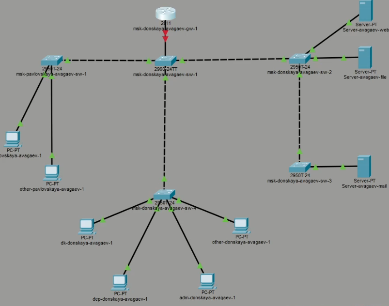
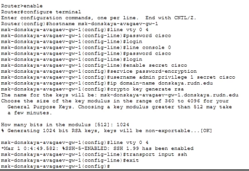
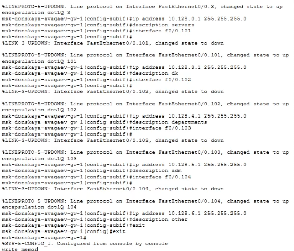

---
## Author
author:
  name: Арсений Валерьевич Агаев
  email: 1032221668@rudn.ru
  affiliation:
    - name: Российский университет дружбы народов
      country: Российская Федерация
      postal-code: 117198
      city: Москва
      address: ул. Миклухо-Маклая, д. 6

## Title
title: "Лабораторная работа №6"
subtitle: "Статическая маршрутизация VLAN"
license: "CC BY"
---

# Цель работы

Настроить статическую маршрутизацию VLAN в сети.

# Задание

- Добавить в локальную сеть маршрутизатор, провести его первоначальную настройку.

- Настроить статическую маршрутизацию VLAN.

# Выполнение лабораторной работы

## Размещение маршрутизатора

Вначале я разметил маршрутизатор Cisco 2811 и подключил его к 
```msk-donskaya-avagaev-sw-1``` к порту 24 ([рис. @fig-001]).

{#fig-001 width=70%}

## Первоначальная настройка марштуризатора

После произвел первичную настройку маршрутизатора.

Сначала изменил имя хоста, настроил вход по паролю для консоли и кабеля:
```
enable
configure terminal
hostname msk-donskaya-avagaev-gw-1

line vty 0 4
password cisco
login

line console 0
password cisco
login
```

Далее, настроил вход по паролю по SSH и доменное имя: 

```
enable secret cisco
service password-encryption

username admin privilege 1 secret cisco

ip domain-name donskaya.rudn.edu
crypto key generate rsa
line vty 0 4
transport input ssh
```

{#fig-002 width=70%}

## Настройка 24 порта коммутатора ```msk-donskaya-avagaev-sw-1```

Аналогично предыдущей лабораторной работе, настроил 24 порт коммутатора
```msk-donskaya-avagaev-sw-1``` ([рис. @fig-003]):

```
enable
configure terminal
interface f0/24
switchport mode trunk
```

{#fig-003 width=70%}

## Настройка виртуальных интерфейсов на маршрутизаторе

Сначала я влючил порт 0 на маршрутизаторе:

```
enable
configure terminal

interface f0/0
no shutdown
```

После настроил VLAN 2 согласно спецификации:
```
interface f0/0.2
encapsulation dot1Q 2
ip address 10.128.1.1 255.255.255.0
description management
```

Аналогично VLAN 3:
```
interface f0/0.3
encapsulation dot1Q 3
ip address 10.128.0.1 255.255.255.0
description servers
```

Аналогично VLAN 101:
```
interface f0/0.101
encapsulation dot1Q 101
ip address 10.128.3.1 255.255.255.0
description dk
```

Аналогично VLAN 102:
```
interface f0/0.102
encapsulation dot1Q 102
ip address 10.128.4.1 255.255.255.0
description departments
```

Аналогично VLAN 103:
```
interface f0/0.103
encapsulation dot1Q 103
ip address 10.128.5.1 255.255.255.0
description adm
```

Аналогично VLAN 104:
```
interface f0/0.104
encapsulation dot1Q 104
ip address 10.128.6.1 255.255.255.0
description other
```

{#fig-004 width=70%}

## Проверка доступности оконечных устройств

Проверил доступность устройств в одной VLAN сети:
```
ping 10.128.3.201
```

И в разных VLAN сетях:
```
ping 10.128.5.200

ping 10.128.4.200
```

{#fig-005 width=70%}

# Выводы

Я настроил статическую маршрутизацию VLAN в сети.
