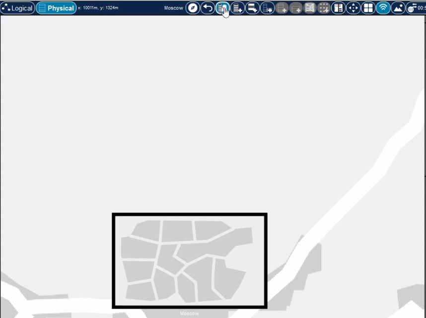
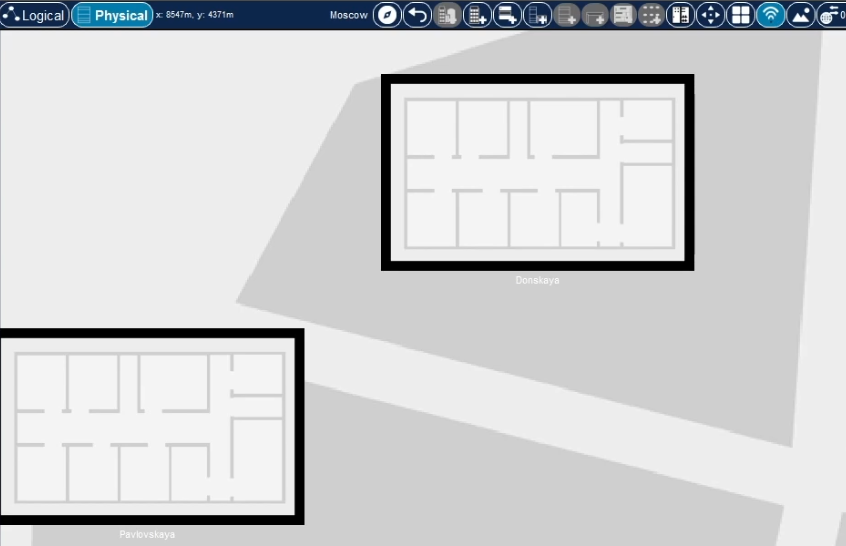
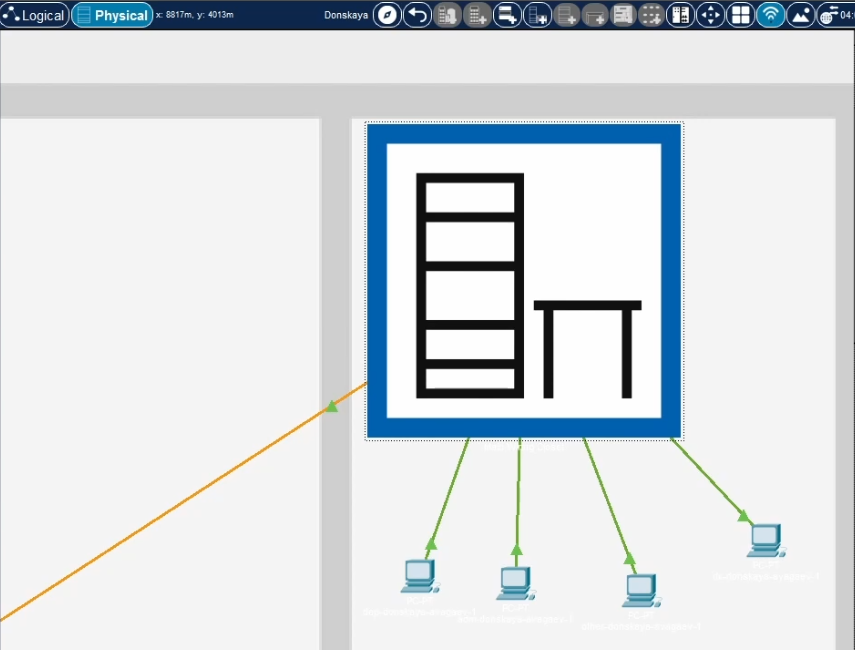
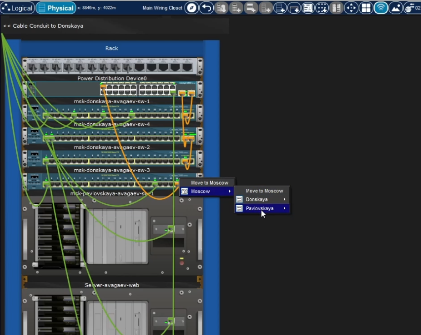
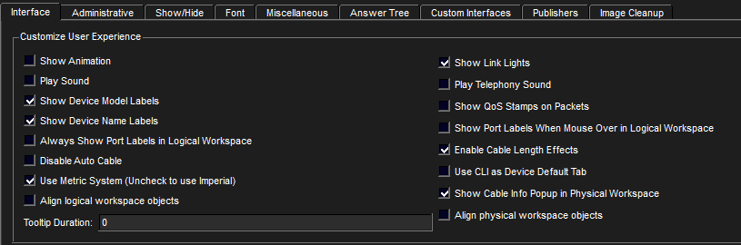
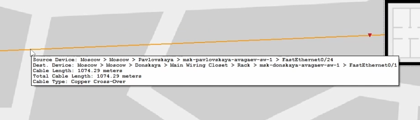

---
## Author
author:
  name: Арсений Валерьевич Агаев
  email: 1032221668@rudn.ru
  affiliation:
    - name: Российский университет дружбы народов
      country: Российская Федерация
      postal-code: 117198
      city: Москва
      address: ул. Миклухо-Маклая, д. 6

## Title
title: Лабораторная работа №7
subtitle: Учёт физических параметров сети
license: CC BY
date: today
date-format: "YYYY-MM-DD" # Example: 2025-09-06
---
# Информация

## Докладчик

:::::::::::::: {.columns align=center}
::: {.column width="70%"}

  * Арсений Валерьевич Агаев
  * студент
  * Российский университет дружбы народов им. П. Лумумбы
  * [1032221668@rudn.ru](mailto:1032221668@rudn.ru)

:::
::: {.column width="30%"}

:::
::::::::::::::

# Цели и задачи

Получить навыки работы с физической рабочей областью Packet Tracer, а также учесть физические параметры сети.

- Требуется заменить соединение между коммутаторами двух территорий ```msk-donskaya-avagaev-sw-1``` и
```msk-pavlovskaya-avagaev-sw-1``` на соединение, учитывающее физические параметры сети, 
а именно - расстояние между двумя террирориями.

# Содержание исследования

## Создание физической области

Присвоил название городу - Moscow.

{#fig-001 width=70%}

## Создание физической области

В городе добавил два здания: Donskaya и Pavlovskaya.

{#fig-002 width=70%}

## Создание физической области

Корректно расположил имеющиеся устройства.

{#fig-003 width=70%}

## Создание физической области

Перемесетил коммутатор и два оконечных устройства .

{#fig-004 width=70%}

## Создание физической области

Убедился в работоспособности соединения.

{#fig-005 width=70%}

## Настройка учёета расстояния

Активировал разрешение на учёт физических характеристик среди передачи.

{#fig-006 width=70%}

## Настройка учёета расстояния

Разместил две террирории на растоянии более 1000 м друг от друга.

{#fig-007 width=70%}

## Настройка учёета расстояния

Проверил работоспособность соединения.

{#fig-008 width=70%}

## Добавление репиторов в сеть

Добавил два репитора.

{#fig-009 width=70%}

## Добавление репиторов в сеть

Переместил репитор ```msk-pavlovskaya-avagaev-mc-1``` на территорию Pavlovskaya.

{#fig-010 width=70%}

## Добавление репиторов в сеть

После я заменил прямое соединение между террирориями на соединение через созданные репиторы.

{#fig-011 width=70%}

## Добавление репиторов в сеть

Проверил работоспособность соединения.

{#fig-012 width=70%}

# Результаты

Я успешно получил навыки работы с физической рабочей областью Packet Tracer, а также учёл физические параметры сети.
