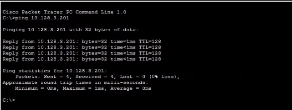
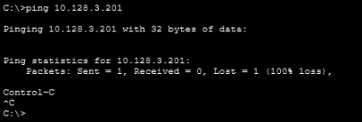
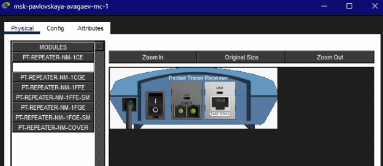
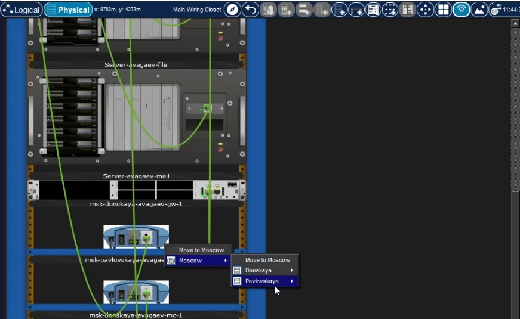
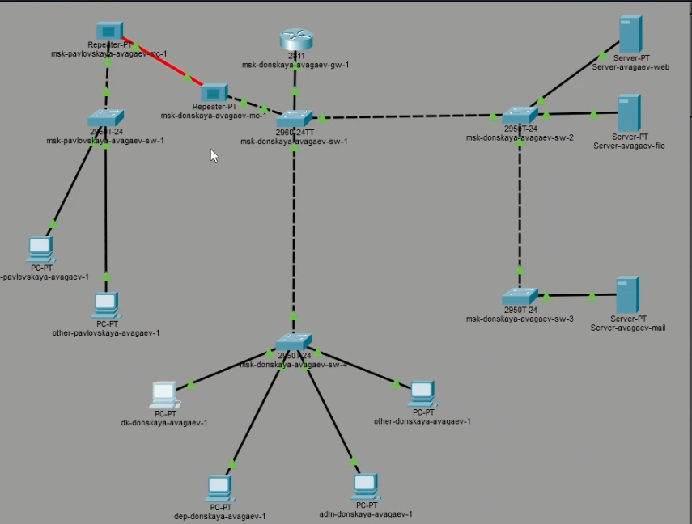
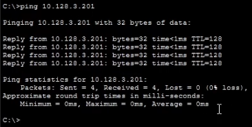

---
## Author
author:
  name: Арсений Валерьевич Агаев
  email: 1032221668@rudn.ru
  affiliation:
    - name: Российский университет дружбы народов
      country: Российская Федерация
      postal-code: 117198
      city: Москва
      address: ул. Миклухо-Маклая, д. 6

## Title
title: "Лабораторная работа №7"
subtitle: "Учёт физических параметров сети"
license: "CC BY"
---

# Цель работы

Получить навыки работы с физической рабочей областью Packet Tracer, а также учесть физические параметры сети.

# Задание

Требуется заменить соединение между коммутаторами двух территорий ```msk-donskaya-avagaev-sw-1``` и
```msk-pavlovskaya-avagaev-sw-1``` на соединение, учитывающее физические параметры сети, 
а именно - расстояние между двумя террирориями.

# Выполнение лабораторной работы

## Создание физической области

Я перешел в физическую рабочую область Packet Tracer и присвоил название 
городу - Moscow ([рис. @fig-001]).

{#fig-001 width=70%}

В городе добавил два здания: Donskaya и Pavlovskaya ([рис. @fig-002]).

{#fig-002 width=70%}

После в здании Donskaya корректно расположил имеющиеся устройства ([рис. @fig-003]).

{#fig-003 width=70%}

Во вкладке серверной перемесетил соответвтвующим функционалом коммутатор 
```msk-pavlovskaya-avagaev-sw-1``` и два оконечных устройства 
```dk-pavlovskaya-avagaev-1``` и ```other-pavlovskaya-avagaev-1``` ([рис. @fig-004]).

{#fig-004 width=70%}

Убедился в работоспособности соединения ([рис. @fig-005]).

{#fig-005 width=70%}

## Настройка учёета расстояния

После в меню Options -> Preferences во вкладке Interface активировал разрешение на учёт физических характеристик среди передачи ([рис. @fig-006]).

{#fig-006 width=70%}

Вернулся в физическую рабочую область Packet Tracer и разместил две террирории на растоянии более 1000 м друг от друга ([рис. @fig-007]).

{#fig-007 width=70%}

Вновь проверил работоспособность соединения. Теперь оно не функционирует ([рис. @fig-008]).

{#fig-008 width=70%}

## Добавление репиторов в сеть

В рабочую область добавил два репитора, заменив имеющиеся модули на PT-REPEATER-NM-1FFE и
PT-REPEATER-NM-1CFE ([рис. @fig-009]).

{#fig-009 width=70%}

Переместил репитор ```msk-pavlovskaya-avagaev-mc-1``` на территорию Pavlovskaya ([рис. @fig-010]).

{#fig-010 width=70%}

После я заменил прямое соединение между ```msk-donskaya-avagaev-sw-1``` и
```msk-pavlovskaya-avagaev-sw-1``` на соединение через созданные репиторы ([рис. @fig-011]).

{#fig-011 width=70%}

Вновь проверил работоспособность соединения. Теперь оно снова функционирует ([рис. @fig-012]).

{#fig-012 width=70%}

# Выводы

Я получил навыки работы с физической рабочей областью Packet Tracer, а также учёл физические параметры сети.
