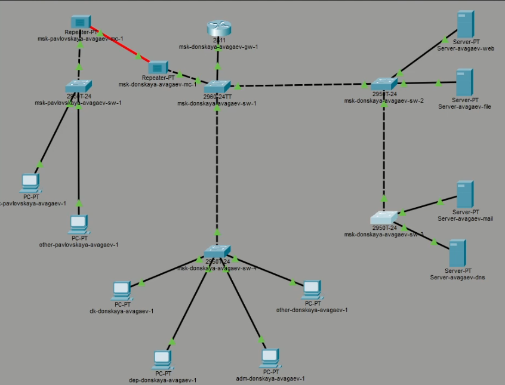
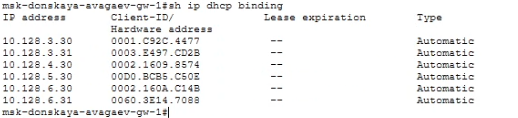

---
## Author
author:
  name: Арсений Валерьевич Агаев
  email: 1032221668@rudn.ru
  affiliation:
    - name: Российский университет дружбы народов
      country: Российская Федерация
      postal-code: 117198
      city: Москва
      address: ул. Миклухо-Маклая, д. 6

## Title
title: Лабораторная работа №8
subtitle: Настройка сетевых сервисов. DHCP
license: CC BY
date: today
date-format: "YYYY-MM-DD" # Example: 2025-09-06
---
# Информация

## Докладчик

:::::::::::::: {.columns align=center}
::: {.column width="70%"}

  * Арсений Валерьевич Агаев
  * студент
  * Российский университет дружбы народов им. П. Лумумбы
  * [1032221668@rudn.ru](mailto:1032221668@rudn.ru)

:::
::: {.column width="30%"}

:::
::::::::::::::

# Цели и задачи

Приобретение практических навыков по настройке динамического распределения IP-адресов посредством протокола DHCP в локальной сети.

- Добавить DNS-записи для домена donskaya.rudn.ru на сервер dns.

- Настроить DHCP-сервис на маршрутизаторе.

- Заменить в конфигурации оконечных устройствах статическое распределение адресов на динамическое.

# Содержание исследования

## Добавление и настройка DNS сервера

Добавил сервер к коммутатору.

{#fig-001 width=70%}

## Добавление и настройка DNS сервера

Указал адрес шлюза и адрес сервера.

{#fig-002 width=70%}

## Добавление и настройка DNS сервера

Активировал DNS службу.

{#fig-003 width=70%}

## Добавление и настройка DNS сервера

Добавил все необходимые DNS-записи.

{#fig-004 width=70%}

## Настройка DHCP-сервиса на маршрутизаторе

Используя команды ниже, настроил DHCP-сервис на маршрутизаторе:

```
enable
configure terminal

ip name-server 10.128.0.5

service dhcp

ip dhcp pool dk
network 10.128.3.0 255.255.255.0
default-router 10.128.3.1
dns-server 10.128.0.5
exit
ip dhcp excluded-address 10.128.3.1 10.128.3.29
ip dhcp excluded-address 10.128.3.200 10.128.3.254

ip dhcp pool department
network 10.128.4.0 255.255.255.0
default-router 10.128.4.1
dns-server 10.128.0.5
exit
ip dhcp excluded-address 10.128.4.1 10.128.4.29
ip dhcp excluded-address 10.128.4.200 10.128.4.254

ip dhcp pool adm
network 10.128.5.0 255.255.255.0
default-router 10.128.5.1
dns-server 10.128.0.5
exit
ip dhcp excluded-address 10.128.5.1 10.128.5.29
ip dhcp excluded-address 10.128.5.200 10.128.5.254

ip dhcp pool dk
network 10.128.6.0 255.255.255.0
default-router 10.128.6.1
dns-server 10.128.0.5
exit
ip dhcp excluded-address 10.128.6.1 10.128.6.29
ip dhcp excluded-address 10.128.6.200 10.128.6.254
```

## Настройка DHCP-сервиса на маршрутизаторе

{#fig-005 width=70%}

## Настройка DHCP-сервиса на маршрутизаторе

На оконечных устройствах установил динамическое распределение адресов.

{#fig-006 width=70%}

## Проверка работоспособности

Выданные адреса соответствуют правилам.

{#fig-007 width=70%}

## Проверка работоспособности

С оконечного устройства пропинговал другие устройства сети.

{#fig-008 width=70%}

# Результаты

Я успешно приобрел практические навыки по настройке динамического распределения IP-адресов посредством протокола DHCP в локальной сети.
