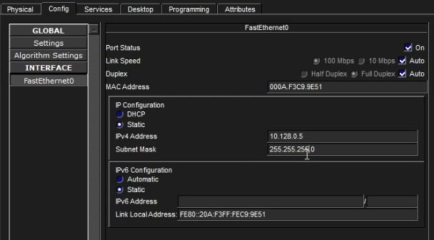
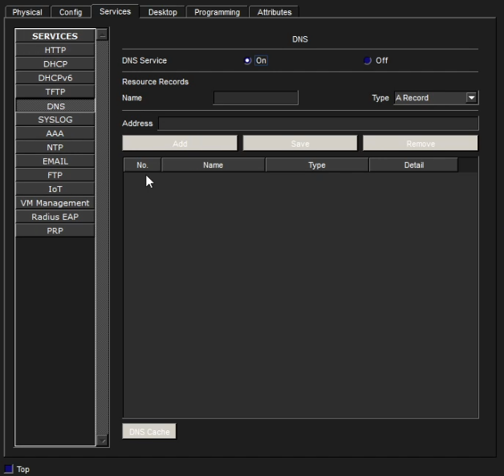
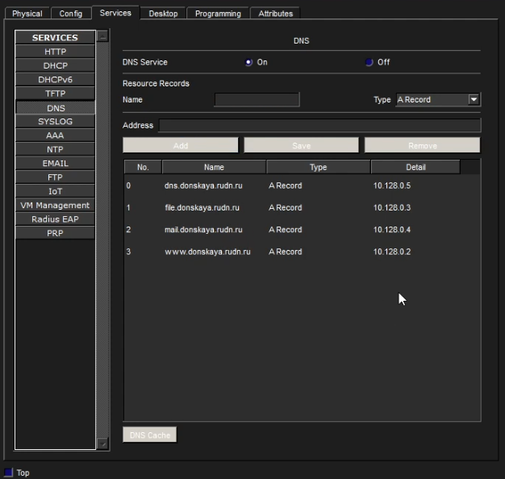
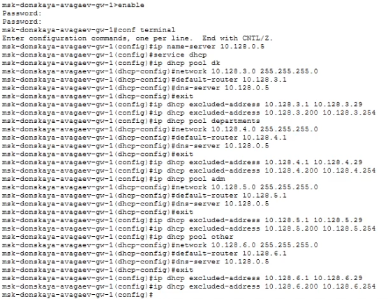
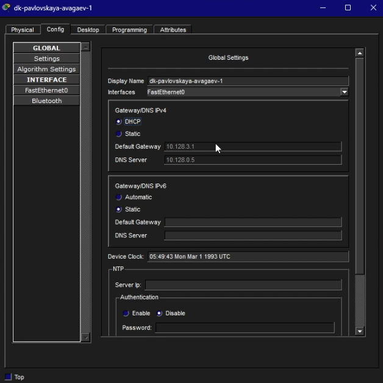
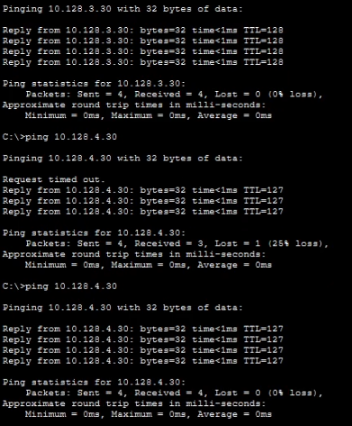

---
## Author
author:
  name: Арсений Валерьевич Агаев
  email: 1032221668@rudn.ru
  affiliation:
    - name: Российский университет дружбы народов
      country: Российская Федерация
      postal-code: 117198
      city: Москва
      address: ул. Миклухо-Маклая, д. 6

## Title
title: "Лабораторная работа №8"
subtitle: "Настройка сетевых сервисов. DHCP"
license: "CC BY"
---

# Цель работы

Приобретение практических навыков по настройке динамического распределения IP-адресов посредством протокола DHCP в локальной сети.

# Задание

- Добавить DNS-записи для домена donskaya.rudn.ru на сервер dns.

- Настроить DHCP-сервис на маршрутизаторе.

- Заменить в конфигурации оконечных устройствах статическое распределение адресов на динамическое.

# Выполнение лабораторной работы

## Добавление и настройка DNS сервера

В логическую рабочую область я добавил сервер ```Server-avagaev-dns``` к коммутатору 
```msk-donskaya-avagaev-sw-3``` через порт ```Fa 0/2``` ([рис. @fig-001]).

{#fig-001 width=70%}

В конфигурации сервера указал адрес шлюза ```10.128.0.1``` и адрес сервера ```10.128.0.5``` с 
маской ```255.255.255.0``` ([рис. @fig-002]).

{#fig-002 width=70%}

В конфигурации сервера активировал DNS службу ([рис. @fig-003]).

{#fig-003 width=70%}

Добавил все необходимые DNS-записи: ```dns.donskaya.rudn.ru```, ```file.donskaya.rudn.ru```, 
```mail.donskaya.rudn.ru```, ```www.donskaya.rudn.ru``` ([рис. @fig-004]).

{#fig-004 width=70%}

## Настройка DHCP-сервиса на маршрутизаторе

Настроил DHCP-сервис на маршрутизаторе ```msk-donskaya-avagaev-gw-1```.

Базовые настройки сервиса:
```
enable
configure terminal

ip name-server 10.128.0.5

service dhcp
```

Настройки VLAN:
```
ip dhcp pool dk
network 10.128.3.0 255.255.255.0
default-router 10.128.3.1
dns-server 10.128.0.5
exit
ip dhcp excluded-address 10.128.3.1 10.128.3.29
ip dhcp excluded-address 10.128.3.200 10.128.3.254

ip dhcp pool department
network 10.128.4.0 255.255.255.0
default-router 10.128.4.1
dns-server 10.128.0.5
exit
ip dhcp excluded-address 10.128.4.1 10.128.4.29
ip dhcp excluded-address 10.128.4.200 10.128.4.254

ip dhcp pool adm
network 10.128.5.0 255.255.255.0
default-router 10.128.5.1
dns-server 10.128.0.5
exit
ip dhcp excluded-address 10.128.5.1 10.128.5.29
ip dhcp excluded-address 10.128.5.200 10.128.5.254

ip dhcp pool dk
network 10.128.6.0 255.255.255.0
default-router 10.128.6.1
dns-server 10.128.0.5
exit
ip dhcp excluded-address 10.128.6.1 10.128.6.29
ip dhcp excluded-address 10.128.6.200 10.128.6.254
```

{#fig-005 width=70%}

На оконечных устройствах заменил в настройках статическое распределение адресов на 
динамическое (пример настройки на ```dk-pavlovskaya-avagaev-1``` [рис. @fig-006]).

{#fig-006 width=70%}

## Проверка работоспособности

Выдаваемые IP адреса маршрутизатором соответствуют планируемой конфигурации ([рис. @fig-007]).

{#fig-007 width=70%}

С оконечного устройства ```dk-donskaya-avagaev-1``` пропинговал другие устройства сети ([рис. @fig-008]).

{#fig-008 width=70%}

# Выводы

Я приобрел практические навыки по настройке динамического распределения IP-адресов посредством протокола DHCP в локальной сети.
