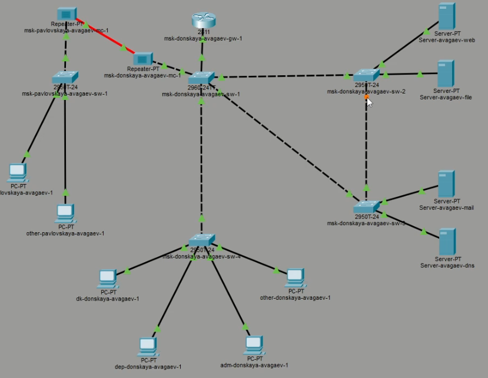
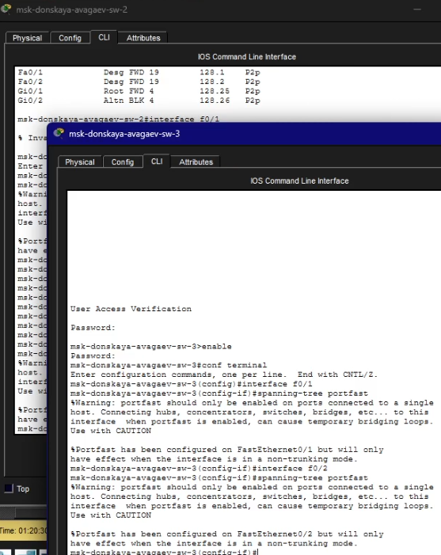
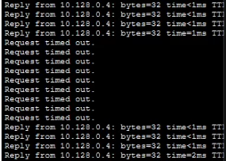
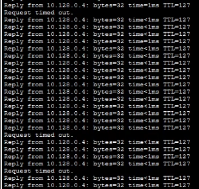
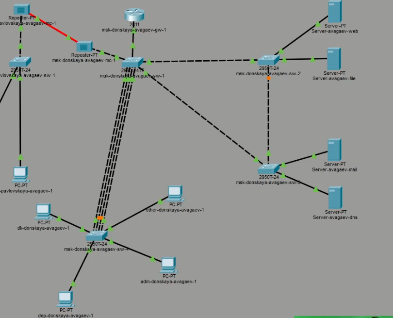
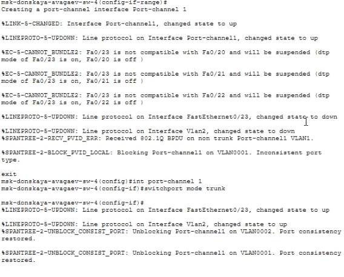

---
## Author
author:
  name: Арсений Валерьевич Агаев
  email: 1032221668@rudn.ru
  affiliation:
    - name: Российский университет дружбы народов
      country: Российская Федерация
      postal-code: 117198
      city: Москва
      address: ул. Миклухо-Маклая, д. 6

## Title
title: "Лабораторная работа №9"
subtitle: "Использование протокола STP. Агрегирование каналов"
license: "CC BY"
---

# Цель работы

Изучение возможностей протокола STP и его модификаций по обеспечению отказоустойчивости 
сети, агрегированию интерфейсов и перераспределению нагрузки между ними.

# Задание

- Сформировать резервное соединение между коммутаторами ```msk-donskaya-avagaev-sw-1``` 
и ```msk-donskaya-avagaev-sw-3```.

- Настройте балансировку нагрузки между резервными соединениями.

- Настройте режим Portfast на тех интерфейсах коммутаторов, к которым подключены серверы.

- Изучите отказоустойчивость резервного соединения.

- Сформируйте и настройте агрегированное соединение интерфейсов Fa0/20 – Fa0/23 между 
коммутаторами ```msk-donskaya-avagaev-sw-1``` и ```msk-donskaya-avagaev-sw-4```.

# Выполнение лабораторной работы

## Создание резервного соединения

Я заменил соединение между коммутаторами ```msk-donskaya-avagaev-sw-1``` 
и ```msk-donskaya-avagaev-sw-4``` на соединение между коммутаторами
```msk-donskaya-avagaev-sw-1``` и ```msk-donskaya-avagaev-sw-3```.

После перевел порт Gig0/2 на коммутаторе ```msk-donskaya-avagaev-sw-3``` в 
Trunk режим:

```
enable
configure terminal
interface g0/2
switchport mode trunk
```

Соединил ```msk-donskaya-avagaev-sw-1``` и ```msk-donskaya-avagaev-sw-4``` через 
порты Fa0/23 и аналогично перевел их в режим Trunk. 

{#fig-001 width=70%}

## Перенастройка основного соединения

В плане выполнения лабораторной работы идет проверка на то, что пакеты идут по старому пути.
В моем случае, они сразу шли по новому пути.

Но я проделал шаги и настроил в качестве корвевого коммутатора ```msk-donskaya-avagaev-sw-1```.

```
enable
configure terminal
spanning-tree vlan 3 root primary
```

{#fig-002 width=70%}

После настроил режим Portfast на интерфейсах, к которым подключены серверы:

```msk-donskaya-avagaev-sw-2```:
```
interface f0/1
spanning-tree portfast

interface f0/2
spanning-tree portfast
```

```msk-donskaya-avagaev-sw-3```:
```
interface f0/1
spanning-tree portfast

interface f0/2
spanning-tree portfast
```

{#fig-003 width=70%}

## Изучение отказоучтойчивости

Для изучения отказоустойчивости, я начал с устройства ```dk-donskaya-avagaev-1```
пинговать ```mail.donskaya.rudn.ru``` и во время пинга, обеспечил разрыв, отключением
порта на коммутаторе

{#fig-004 width=70%}

Как видно, соединение со временем возобновилось.

После я переключил все коммутаторы в режим работы по протоколу Rapid PVST+

В качестве примера, настройка ```msk-donskaya-avagaev-sw-1```:
```
spanning −tree mode rapid −pvst
```

{#fig-005 width=70%}

Вновь пропинговал сервер и смоделировал отказ соединения.

{#fig-006 width=70%}

Время смены соединения значительно уменьшилось до 1 потерянного пакета.

## Агрегированное соединение

Сформировал агрегированное соединение интерфейсов Fa0/20 – Fa0/23 между 
коммутаторами ```msk-donskaya-avagaev-sw-1``` и ```msk-donskaya-avagaev-sw-4``` 

{#fig-007 width=70%}

И настроил агрегирование каналов

```msk-donskaya-avagaev-sw-1```:
```
interface range f0/20 - 23
channel-group 1 mode on
exit
interface port-channel 1
switchport mode trunk
```

```msk-donskaya-avagaev-sw-4```:
```
interface range f0/20 - 23
no switchport access vlan 104
channel-group 1 mode on
exit
interface port-channel 1
switchport mode trunk
```

{#fig-008 width=70%}

# Выводы

Я изучил возможности протокола STP и его модификаций по обеспечению отказоустойчивости 
сети, агрегированию интерфейсов и перераспределению нагрузки между ними.
