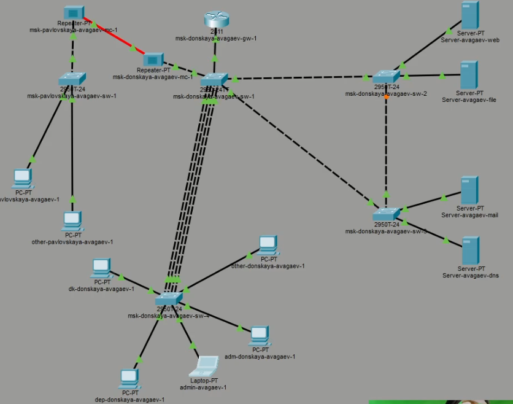
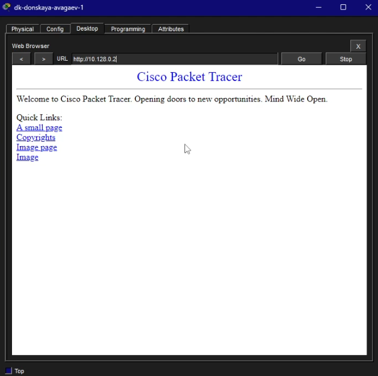
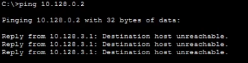
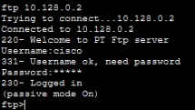
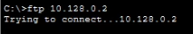
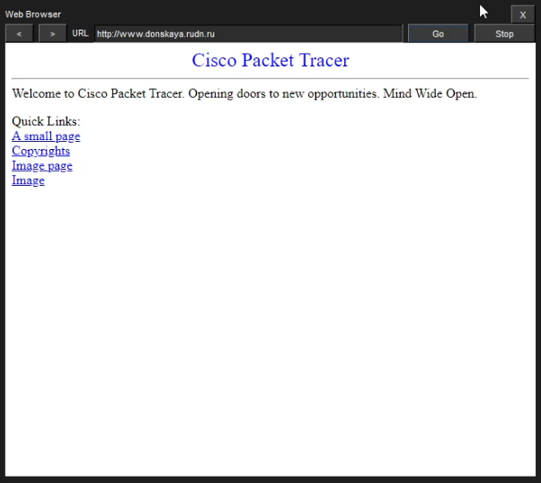
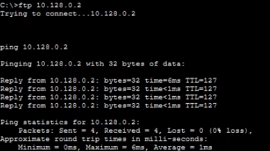
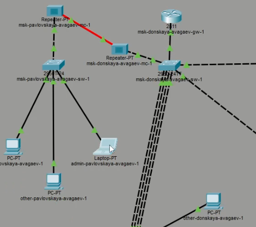
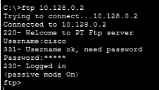

---
## Author
author:
  name: Арсений Валерьевич Агаев
  email: 1032221668@rudn.ru
  affiliation:
    - name: Российский университет дружбы народов
      country: Российская Федерация
      postal-code: 117198
      city: Москва
      address: ул. Миклухо-Маклая, д. 6

## Title
title: "Лабораторная работа №10"
subtitle: "Настройка списков управления доступом (ACL)" 
license: "CC BY"
---

# Цель работы

Освоить настройку прав доступа пользователей к ресурсам сети.

# Задание

- Необходимо настроить следующие правила доступа:

	- web-сервер: разрешить доступ всем пользователям по протоколу HTTP через 
	порт 80 протокола TCP, а для администратора открыть доступ по протоколам Telnet и FTP;

	- файловый сервер: с внутренних адресов сети доступ открыт по портам для 
	общедоступных каталогов, с внешних — доступ по протоколу FTP;

	- почтовый сервер: разрешить пользователям работать по протоколам SMTP и 
	POP3 (соответственно через порты 25 и 110 протокола TCP), а для администратора — 
	открыть доступ по протоколам Telnet и FTP;

	- DNS-сервер: открыть порт 53 протокола UDP для доступа из внутренней сети;

	- разрешить icmp-сообщения, направленные в сеть серверов;

	- запретить для сети Other любые запросы за пределы сети, за исключением администратора;

	- разрешить доступ в сеть управления сетевым оборудованием только
	администратору сети.

- Проверить правильность действия установленных правил.

- Выполнить задание для самостоятельной работы по настройке прав 
доступа администратора сети на Павловской.

# Выполнение лабораторной работы

## Настройка правил

Вначале я добавил в рабочую область ноутбук администратора с именем ```admin-avagaev-1```, 
подключил его к порту 24 коммутатора ```msk-donskaya-avagaev-sw-4``` и присвоил ему статический адрес
```10.128.6.200``` ([рис. @fig-001]).

{#fig-001 width=70%}

После я начал настройку прав доступа на маршрутизаторе ```msk-donskaya-avagaev-gw-1```.

Настройка доступа к web-серверу по порту tcp 80:
```
ip access-list extended servers-out
remark web
permit tcp any host 10.128.0.2 eq 80
```

Добавление списка управления доступом к интерфейсу:
```
interface f0/0.3
ip access-group servers-out out
```

{#fig-002 width=70%}

{#fig-003 width=70%}

После добавление доступа к web-серверу для администратора по протоколам Telnet и FTP:
```
ip access-list extended servers-out
permit tcp host 10.128.6.200 host 10.128.0.2 range 20 ftp
permit tcp host 10.128.6.200 host 10.128.0.2 eq telnet
```

{#fig-004 width=70%}

{#fig-005 width=70%}

Добавление доступа к файловому серверу:
```
ip access-list extended servers-out
remark file
permit tcp 10.128.0.0 0.0.255.255 host 10.128.0.3 eq 445
permit tcp any host 10.128.0.3 range 20 ftp
```

Добавление доступа к почтовому серверу:
```
ip access-list extended servers-out
remark mail
permit tcp any host 10.128.0.4 eq smtp
permit tcp any host 10.128.0.4 eq pop3
```

Добавление доступа к DNS-серверу:
```
ip access-list extended servers-out
remark dns
permit udp 10.128.0.0 0.0.255.255 host 10.128.0.5 eq 53
```

{#fig-006 width=70%}

Добавление доступа к icmp-запросам (ping):
```
ip access-list extended servers-out
1 permit icmp any any
```

Данное правило было явно задано в начале списка правил.

Добавление доступа для сети Other:
```
ip access-list extended other-in
remark admin
permit ip host 10.128.6.200 any
exit
interface f0/0.104
ip access-group other-in in
```

Добавление доступа к сети сетевого оборудования для администратора:
```
ip access-list extended management-out
remark admin
permit ip host 10.128.6.200 10.128.1.0 0.0.0.255
exit
interface f0/0.2
ip access-group management-out out
```

## Проверка правил

Проверка доступа по icmp и блокировка по ftp до web-сервера.

{#fig-007 width=70%}

## Самостоятельная работа

Добавил в рабочую область ноутбук администратора с именем ```admin-pavlovskaya-avagaev-1```, 
подключил его к порту 23 коммутатора ```msk-pavlovskaya-avagaev-sw-1``` и присвоил ему статический адрес
```10.128.6.201``` ([рис. @fig-008]).

{#fig-008 width=70%}

После настроил аналогичные правила доступа под данный ноутбук:
```
ip access-list extended servers-out
permit tcp host 10.128.6.201 host 10.128.0.2 range 20 ftp
permit tcp host 10.128.6.201 host 10.128.0.2 eq telnet

ip access-list extended other-in
remark admin
permit ip host 10.128.6.201 any
exit
interface f0/0.104
ip access-group other-in in

ip access-list extended management-out
remark admin
permit ip host 10.128.6.201 10.128.1.0 0.0.0.255
exit
interface f0/0.2
ip access-group management-out out
```

После проверил корректность правил ([рис. @fig-009]).

{#fig-009 width=70%}

# Выводы

Я освоил настройку прав доступа пользователей к ресурсам сети.
