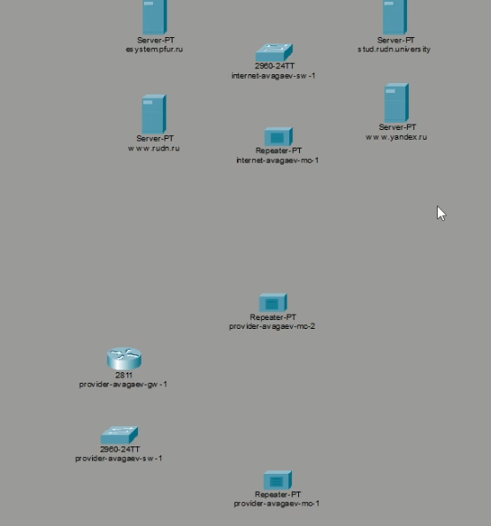
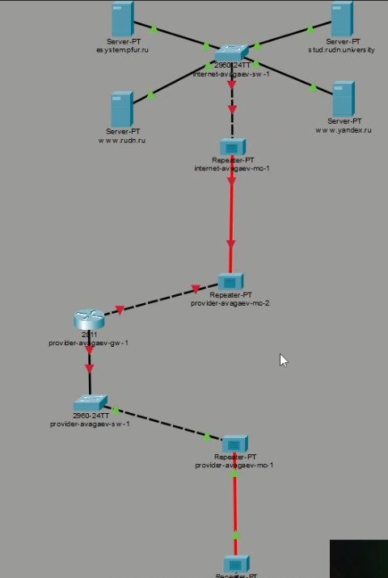
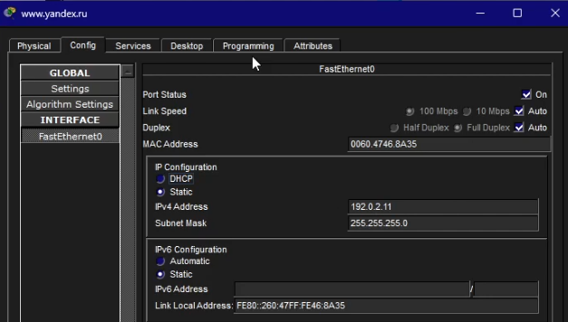
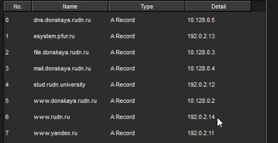

---
## Author
author:
  name: Арсений Валерьевич Агаев
  email: 1032221668@rudn.ru
  affiliation:
    - name: Российский университет дружбы народов
      country: Российская Федерация
      postal-code: 117198
      city: Москва
      address: ул. Миклухо-Маклая, д. 6

## Title
title: Лабораторная работа №11
subtitle: Настройка NAT. Планирование
license: CC BY
date: today
date-format: "YYYY-MM-DD" # Example: 2025-09-06
---
# Информация

## Докладчик

:::::::::::::: {.columns align=center}
::: {.column width="70%"}

  * Арсений Валерьевич Агаев
  * студент
  * Российский университет дружбы народов им. П. Лумумбы
  * [1032221668@rudn.ru](mailto:1032221668@rudn.ru)

:::
::: {.column width="30%"}

:::
::::::::::::::

# Цели и задачи

Провести подготовительные мероприятия по подключению локальной сети организации к Интернету.

- Построить схему подсоединения локальной сети к Интернету.

- Построить модельные сети провайдера и сети Интернет.

- Построить схемы сетей L1, L2, L3.

# Содержание исследования

## Моделирование сети Интернет

На логичской схеме были размещены 4 медиаконвертера, 2 коммутатора, 
маршрутизатор и 4 сервера.

{#fig-001 width=70%}

## Моделирование сети Интернет

В физической рабочей области разместил здания ([рис. @fig-002]).

{#fig-002 width=70%}

## Моделирование сети Интернет

Перенес оборудование из сети "Донская" в соответствующие здания провайдера и сети 
Интренет.

{#fig-003 width=70%}

## Моделирование сети Интернет

{#fig-004 width=70%}

## Моделирование сети Интернет

Заменил имеющиеся модули на репиторах.

{#fig-005 width=70%}

## Моделирование сети Интернет

Соединил объекты между собой в логической области.

{#fig-006 width=70%}

## Моделирование сети Интернет

Прописал IP-адреса серверам.

{#fig-007 width=70%}

## Моделирование сети Интернет

Прописал сведения о серверах на DNS-сервере сети "Донская".

{#fig-008 width=70%}

# Результаты

Я успешно провёл подготовительные мероприятия по подключению локальной сети организации к Интернету.
