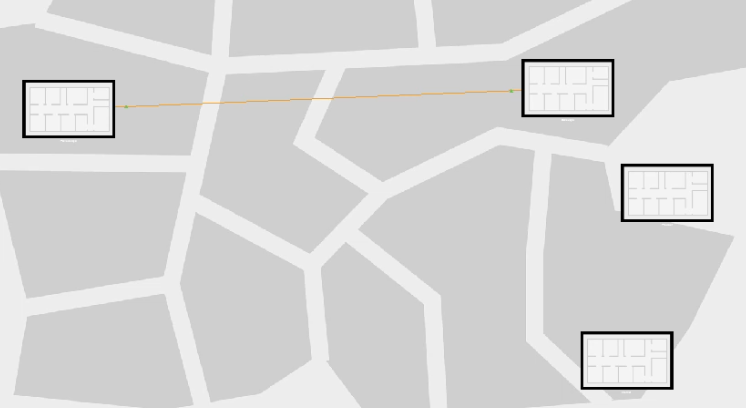
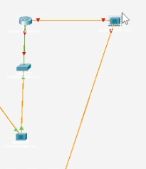
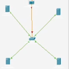
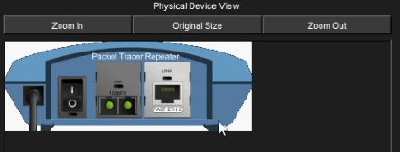

---
## Author
author:
  name: Арсений Валерьевич Агаев
  email: 1032221668@rudn.ru
  affiliation:
    - name: Российский университет дружбы народов
      country: Российская Федерация
      postal-code: 117198
      city: Москва
      address: ул. Миклухо-Маклая, д. 6

## Title
title: "Лабораторная работа №11"
subtitle: "Настройка NAT. Планирование"
license: "CC BY"
---

# Цель работы

Провести подготовительные мероприятия по подключению локальной сети организации к Интернету.

# Задание

- Построить схему подсоединения локальной сети к Интернету.

- Построить модельные сети провайдера и сети Интернет.

- Построить схемы сетей L1, L2, L3.

# Выполнение лабораторной работы

## Моделирование сети Интернет

На логичской схеме были размещены 4 медиаконвертера (Repeater-PT), 2 коммутатора типа Cisco 2960-24TT, 
маршрутизатор типа Cisco 2811 и 4 сервера ([рис. @fig-001]).

{#fig-001 width=70%}

После создал в физической рабочей области здание провайдера и здание, имитирующее расположение серверов 
модельного Интернета ([рис. @fig-002]).

{#fig-002 width=70%}

Перенес оборудование из сети "Донская" в соответствующие здания провайдера и сети 
Интренет ([рис. @fig-003] и [рис. @fig-004]).

{#fig-003 width=70%}

{#fig-004 width=70%}

Далее, заменил имеющиеся модули на PT-REPEATER-NM-1FFE и PT-REPEATER-NM-1CFE ([рис. @fig-005]).

{#fig-005 width=70%}

После соединил объекты между собой в логической области ([рис. @fig-006]).

{#fig-006 width=70%}

Прописал IP-адреса серверам. В качестве примера, выдача ```www.yandex.ru``` ([рис. @fig-007]).

{#fig-007 width=70%}

Прописал сведения о серверах на DNS-сервере сети "Донская" ([рис. @fig-008]).

{#fig-008 width=70%}

# Выводы

Я провёл подготовительные мероприятия по подключению локальной сети организации к Интернету.
