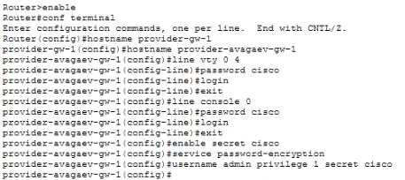
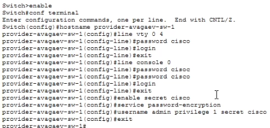
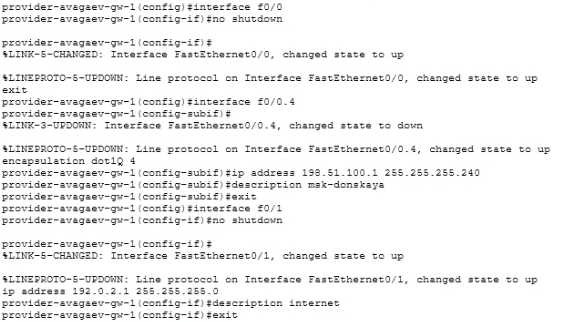
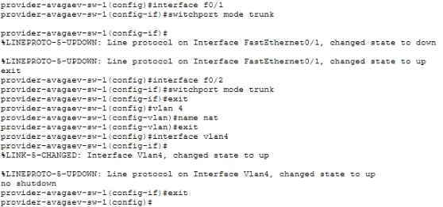
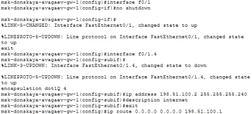
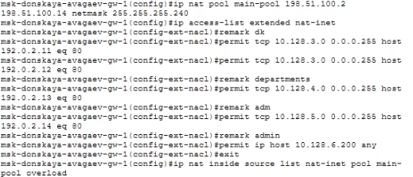
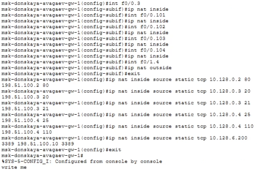
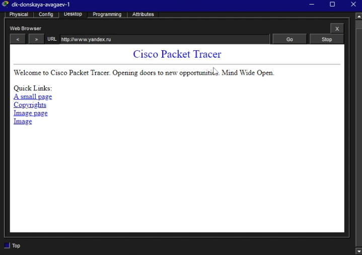

---
## Author
author:
  name: Арсений Валерьевич Агаев
  email: 1032221668@rudn.ru
  affiliation:
    - name: Российский университет дружбы народов
      country: Российская Федерация
      postal-code: 117198
      city: Москва
      address: ул. Миклухо-Маклая, д. 6

## Title
title: "Лабораторная работа №12"
subtitle: "Настройка NAT"
license: "CC BY"
---

# Цель работы

Приобретение практических навыков по настройке доступа локальной сети к внешней сети 
посредством NAT.

# Задание

- Сделать первоначальную настройку маршрутизатора provider-gw-1 и 
коммутатора provider-sw-1 провайдера: задать имя, настроить доступ по паролю и т.п. 

- Настроить интерфейсы маршрутизатора provider-gw-1 и коммутатора
provider-sw-1 провайдера.

- Настроить интерфейсы маршрутизатора сети «Донская» для доступа к сети
провайдера.

- Настроить на маршрутизаторе сети «Донская» NAT с правилами, указанными в разделе 12.2.

- Настроить доступ из внешней сети в локальную сеть организации, как
указано в разделе.

- Проверить работоспособность заданных настроек.

# Выполнение лабораторной работы

## Первоначальная настройка маршрутизатора провайдера

Выполнил стандартную настройку маршрутизатора ```provider-avagaev-gw-1``` ([рис. @fig-001]).

```
enable
configure terminal

line vty 0 4
password cisco
login
exit

line console 0
password cisco
login
exit

enable secret cisco
service password-encryption
username admin privilege 1 secret cisco
```

{#fig-001 width=70%}

## Первоначальная настройка коммутатора провайдера

После выполнил стандартную настройку коммутатора ```provider-avagaev-sw-1``` ([рис. @fig-002]).

```
enable
configure terminal

line vty 0 4
password cisco
login
exit

line console 0
password cisco
login
exit

enable secret cisco
service password-encryption
username admin privilege 1 secret cisco
```

{#fig-002 width=70%}

## Настройка интерфейсов маршрутизатора провайдера

Затем выполнил настройку интерфейсов маршрутизатора ```provider-avagaev-gw-1``` ([рис. @fig-003]).

```
interface f0/0
no shutdown
exit

interface f0/0.4
encapsulation dot1Q 4
ip address 198.51.100.1 255.255.255.240
description msk-donskaya
exit

inteface f0/1
no shutdown
ip address 192.0.2.1 255.255.255.0
description internet
exit
```

{#fig-003 width=70%}

## Настройка интерфейсов коммутатора провайдера

Затем выполнил настройку интерфейсов коммутатора ```provider-avagaev-sw-1``` ([рис. @fig-004]).

```
interface f0/1
switchport mode trunk
exit

interface f0/2
switchport mode trunk
exit

vlan 4
name nat
exit

interface vlan4
no shutdown
exit
```

{#fig-004 width=70%}

## Настройка интерфейсов маршрутизатора Донской

Настроил интерфейсы маршрутизатора ```msk-donskaya-avagaev-gw-1``` ([рис. @fig-005]).

```
enable
configure terminal

interface f0/1
no shutdown
exit

interface f0/1.4
encapsulation dot1Q 4
ip address 198.51.100.2 255.255.255.240
description internet
exit

ip route 0.0.0.0 0.0.0.0 198.51.100.1
exit
```

{#fig-005 width=70%}

## Настройка пула адресов для NAT

```
ip nat pool main-pool 198.51.100.2 198.51.100.14 netmask 255.255.255.240
```

## Настройка списка доступа для NAT

```
ip access-list extended nat-inet
```

## Сеть дисплейных классов

```
remark dk
permit tcp 10.128.3.0 0.0.0.255 host 192.0.2.11 eq 80
permit tcp 10.128.3.0 0.0.0.255 host 192.0.2.12 eq 80
```

## Сеть кафедр

```
remark departments
permit tcp 10.128.4.0 0.0.0.255 host 192.0.2.13 eq 80
```

## Сеть администрации

```
remark adm
permit tcp 10.128.5.0 0.0.0.255 host 192.0.2.14 eq 80
```

## Доступ для компьютера администратора

```
remark admin
permit ip host 10.128.6.200 any
```

## Настройка NAT

```
ip nat inside source list nat-inet pool main-pool overload

interface f0/0.3
ip nat inside

interface f0/0.101
ip nat inside

interface f0/0.102
ip nat inside

interface f0/0.103
ip nat inside

interface f0/0.104
ip nat inside

interface f0/1.4
ip nat outside
exit
```

## Настройка доступа из Интернета. WWW-сервер

```
ip nat inside source static tcp 10.128.0.2 80 198.51.100.2 80
```

## Настройка доступа из Интернета. Файловый сервер

```
ip nat inside source static tcp 10.128.0.3 20 198.51.100.3 20
ip nat inside source static tcp 10.128.0.3 21 198.51.100.3 21
```

## Настройка доступа из Интернета. Почтовый сервер

```
ip nat inside source static tcp 10.128.0.4 25 198.51.100.4 25
ip nat inside source static tcp 10.128.0.4 110 198.51.100.4 110
```

## Настройка доступа из Интернета. Доступ по RDP

```
ip nat inside source static tcp 10.128.6.200 3389 198.51.100.10 3389
```

{#fig-006 width=70%}

{#fig-007 width=70%}

## Проверка работы

В качестве примера работы, зашел на домен ```www.yandex.ru```.

{#fig-008 width=70%}

# Выводы

Я приобрел практические навыки по настройке доступа локальной сети к внешней сети 
посредством NAT.
