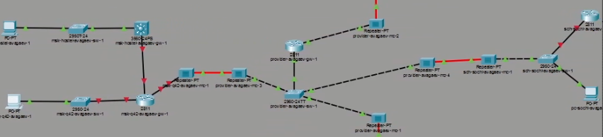
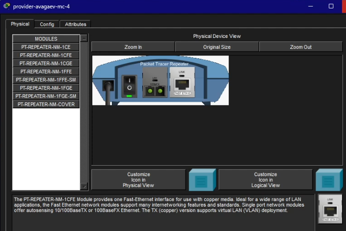
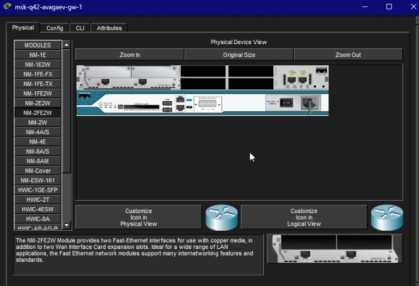
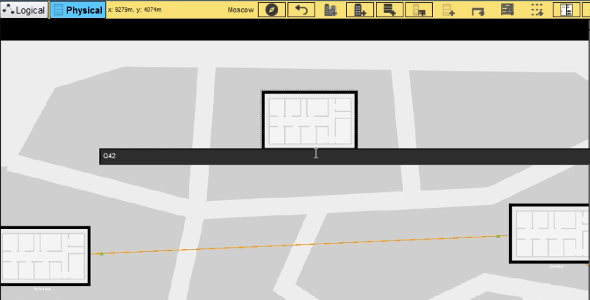
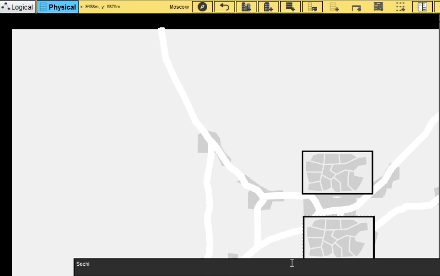
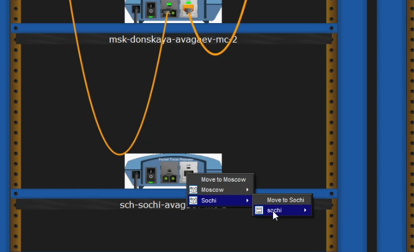

---
## Author
author:
  name: Арсений Валерьевич Агаев
  email: 1032221668@rudn.ru
  affiliation:
    - name: Российский университет дружбы народов
      country: Российская Федерация
      postal-code: 117198
      city: Москва
      address: ул. Миклухо-Маклая, д. 6

## Title
title: Лабораторная работа №13
subtitle: Статическая маршрутизация в Интернете. Планирование
license: CC BY
date: today
date-format: "YYYY-MM-DD" # Example: 2025-09-06
---
# Информация

## Докладчик

:::::::::::::: {.columns align=center}
::: {.column width="70%"}

  * Арсений Валерьевич Агаев
  * студент
  * Российский университет дружбы народов им. П. Лумумбы
  * [1032221668@rudn.ru](mailto:1032221668@rudn.ru)

:::
::: {.column width="30%"}

:::
::::::::::::::

# Цели и задачи

## Цель

Провести подготовительные мероприятия по организации взаимодействия через сеть 
провайдера посредством статической маршрутизации локальной сети с сетью основного 
здания, расположенного в 42-м квартале в Москве, и сетью филиала, расположенного 
в г. Сочи.

## Задачи

- Внести изменения в схемы L1, L2 и L3 сети, добавив в них информацию о сети основной 
территории (42-й квартал в Москве) и сети филиала в г. Сочи.

- Дополнить схему проекта, добавив подсеть основной территории организации 42-го квартала 
в Москве и подсеть филиала в г. Сочи.

- Сделать первоначальную настройку добавленного в проект оборудования.

# Содержание исследования

## Модификация схемы логической области

В логической рабочей области разместил 4 медиаконвертера, 2 маршрутизатора, 
1 маршрутизирующий коммутатор, 2 коммутатора Cisco 2950-24, 1 коммутатор Cisco 2950-24T, 
3 оконечных устройства.

{#fig-001 width=70%}

## Модификация схемы логической области

На медиаконвертерах заменил имеющиеся модули на PT-REPEATER-NM-1FFE и PT-REPEATER-NM-1CFE.

{#fig-002 width=70%}

## Модификация схемы логической области

На маршрутизаторе ```msk-q42-avagaev-gw-1``` добавил дополнительный интерфейс NM-2FE2W.

{#fig-003 width=70%}

## Модификация схемы физической области

В физической рабочей области добавил в г. Москва здание 42-квартала и добавил город Сочи 
и здание филиала в нем.

## Модификация схемы физической области

{#fig-004 width=70%}

## Модификация схемы физической области

{#fig-005 width=70%}

## Модификация схемы физической области

После перенес все оборудования из "Донская" в соответствующие здания.

{#fig-006 width=70%}

## Первоначальная настройка оборудования

msk-q42-avagaev-gw-1:
```
enable
configure terminal

hostname msk-q42-avagaev-gw-1

line vty 0 4
password cisco
login
exit

line console 0
password cisco
login
exit

enable secret cisco
service password-encryption
username admin privilege 1 secret cisco

ip domain-name q42.rudn.edu
crypto key generate rsa
line vty 0 4
transport input ssh
```

## Первоначальная настройка оборудования

msk-q42-avagaev-sw-1:
```
enable
configure terminal

hostname msk-q42-avagaev-sw-1

line vty 0 4
password cisco
login
exit

line console 0
password cisco
login
exit

enable secret cisco
service password-encryption
username admin privilege 1 secret cisco

ip domain-name q42.rudn.edu
crypto key generate rsa
line vty 0 4
transport input ssh
```

## Первоначальная настройка оборудования

msk-hostel-avagaev-gw-1:
```
enable
configure terminal

hostname msk-hotel-avagaev-gw-1

line vty 0 4
password cisco
login
exit

line console 0
password cisco
login
exit

enable secret cisco
service password-encryption
username admin privilege 1 secret cisco

ip ssh version 2
ip domain-name hostel.rudn.edu
crypto key generate rsa
line vty 0 4
transport input ssh
```

## Первоначальная настройка оборудования

msk-hostel-avagaev-sw-1:
```
enable
configure terminal

hostname msk-hostel-avagaev-sw-1

line vty 0 4
password cisco
login
exit

line console 0
password cisco
login
exit

enable secret cisco
service password-encryption
username admin privilege 1 secret cisco

ip domain-name hostel.rudn.edu
crypto key generate rsa
line vty 0 4
transport input ssh
```

## Первоначальная настройка оборудования

sch-sochi-avagaev-sw-1:
```
enable
configure terminal

hostname sch-sochi-avagaev-sw-1

line vty 0 4
password cisco
login
exit

line console 0
password cisco
login
exit

enable secret cisco
service password-encryption
username admin privilege 1 secret cisco

ip domain-name sochi.rudn.edu
crypto key generate rsa
line vty 0 4
transport input ssh
```

## Первоначальная настройка оборудования

sch-sochi-avagaev-gw-1:
```
enable
configure terminal

hostname sch-sochi-avagaev-gw-1

line vty 0 4
password cisco
login
exit

line console 0
password cisco
login
exit

enable secret cisco
service password-encryption
username admin privilege 1 secret cisco

ip domain-name sochi.rudn.edu
crypto key generate rsa
line vty 0 4
transport input ssh
```

# Результаты

Я успешно провел подготовительные мероприятия по организации взаимодействия через сеть провайдера.
