---
## Author
author:
  name: Арсений Валерьевич Агаев
  email: 1032221668@rudn.ru
  affiliation:
    - name: Российский университет дружбы народов
      country: Российская Федерация
      postal-code: 117198
      city: Москва
      address: ул. Миклухо-Маклая, д. 6

## Title
title: "Лабораторная работа №14"
subtitle: "Статическая маршрутизация в Интернете. Настройка"
license: "CC BY"
---

# Цель работы

Настроить взаимодействие через сеть провайдера посредством статической маршрутизации 
локальной сети организации с сетью основного здания, расположенного в 42-м квартале 
в Москве, и сетью филиала, расположенного в г. Сочи.

# Задание

- Настроить связь между территориями.

- Настроить оборудование, расположенное в квартале 42 в Москве.

- Настроить оборудование, расположенное в филиале в г. Сочи.

- Настроить статическую маршрутизацию между территориями.

- Настроить статическую маршрутизацию на территории квартала 42 в г. Москве

- Настроить NAT на маршрутизаторе msk-donskaya-avagaev-gw-1.

# Выполнение лабораторной работы

## Настройка соединения между площадками

### Коммутатор provider-avagaev-sw-1

```
enable
configure terminal

interface f0/3
switchport mode trunk
exit

interface f0/4
switchport mode trunk
exit

vlan 5
name q42
exit

interface vlan5
no shutdown
exit

vlan 6
name sochi
exit

interface vlan6
no shutdown
exit
```

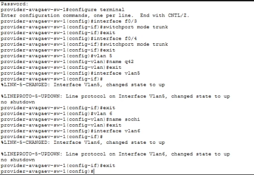{#fig-001 width=70%}

### Маршрутизатор msk-donskaya-avagaev-gw-1

```
enable
configure terminal

interface f0/1.5
encapsulation dot1Q 5
ip address 10.128.255.1 255.255.255.252
description q42
exit

interface f0/1.6
encapsulation dot1Q 6
ip address 10.128.255.5 255.255.255.252
description sochi
exit
```

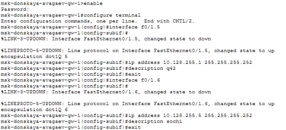{#fig-002 width=70%}

### Маршрутизатор msk-q42-avagaev-gw-1

```
enable
configure terminal

interface f0/1
no shutdown
exit

interface f0/1.5
encapsulation dot1Q 5
ip address 10.128.255.2 255.255.255.252
description donskaya
exit
```

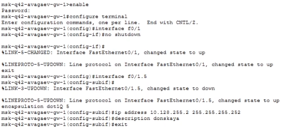{#fig-003 width=70%}

### Коммутатор sch-sochi-avagaev-sw-1

```
enable
configure terminal

interface f0/23
switchport mode trunk
exit

interface f0/24
switchport mode trunk
exit

vlan 6
name sochi
exit

interface vlan6
no shutdown
exit
```

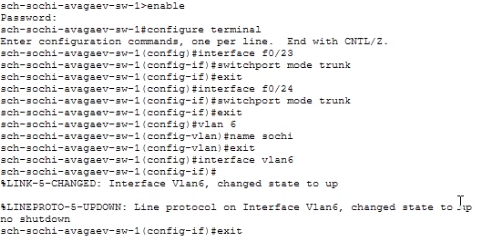{#fig-004 width=70%}

### Маршрутизатор sch-sochi-avagaev-gw-1

```
enable
configure terminal

interface f0/0
no shutdown
exit

interface f0/0.6
encapsulation dot1Q 6
ip address 10.128.255.6 255.255.255.252
description donskaya
exit
```

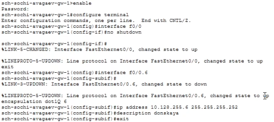{#fig-005 width=70%}

## Настройка площадки 42-го квартала

### Маршрутизатор msk-q42-avagaev-gw-1

```
enable
configure terminal

interface f0/0
no shutdown
exit

interface f0/0.201
encapsulation dot1Q 201
ip address 10.129.0.1 255.255.255.0
description q42-main
exit

interface f1/0
no shutdown
exit

interface f1/0.202
encapsulation dot1Q 202
ip address 10.129.1.1 255.255.255.0
description q42-management
exit
```

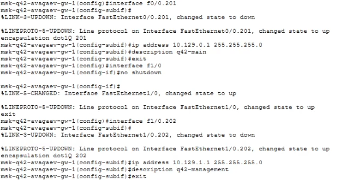{#fig-006 width=70%}

### Коммутатор msk-q42-avagaev-sw-1

```
enable
configure terminal

interface f0/24
switchport mode trunk
exit

interface f0/1
switchport mode access
switchport access vlan 201
exit

vlan 201
name q42-main
exit

interface vlan201
no shutdown
exit
```

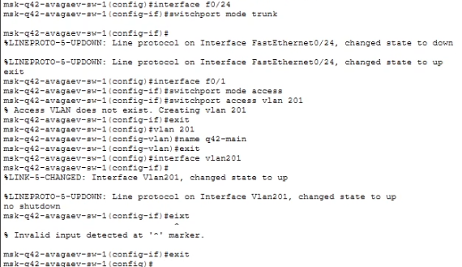{#fig-007 width=70%}

### Маршрутизирующий коммутатор msk-hostel-avagaev-gw-1

```
enable
configure terminal

interface g0/1
switchport trunk encapsulation dot1q
switchport mode trunk
exit

interface f0/1
switchport trunk encapsulation dot1q
switchport mode trunk
exit

vlan 202
name q42-management
exit

interface vlan202
no shutdown
ip address 10.129.1.2 255.255.255.0
exit

vlan 301
name hostel-main
exit

interface vlan301
no shutdown ip address 10.129.128.1 255.255.255.0
exit
```

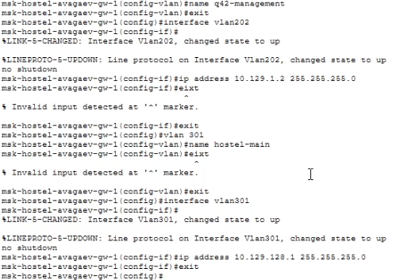{#fig-008 width=70%}

### Коммутатор msk-hostel-avagaev-sw-1

```
enable
configure terminal

interface g0/1
switchport mode trunk
exit

interface f0/1
switchport mode trunk
exit

interface f0/1
switchport mode access
switchport access vlan 301
exit

vlan 301
name hostel-main
exit

interface vlan301
no shutdown
exit
```

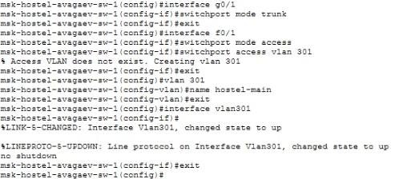{#fig-009 width=70%}

## Настройка площадки в Сочи

### Маршрутизатор sch-sochi-avagaev-gw-1

```
enable
configure terminal

interface f0/0.401
encapsulation dot1Q 401
ip address 10.130.0.1 255.255.255.0
description sochi-main
exit

interface f0/0.402
encapsulation dot1Q 402
ip address 10.130.1.1 255.255.255.0
description sochi-management
exit
```

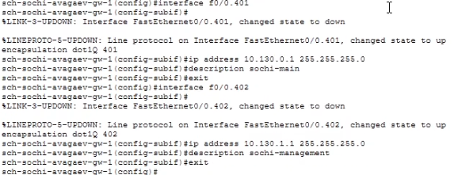{#fig-010 width=70%}

### Коммутатор sch-sochi-avagaev-sw-1

```
enable
configure terminal

interface f0/1
switchport mode access
switchport access vlan 401
exit 

vlan 401
name sochi-main
exit

interface vlan401
no shutdown
exit
```

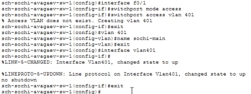{#fig-011 width=70%}

## Настройка маршрутизации между площадками

### Маршрутизатор msk-donskaya-avagaev-gw-1

```
enable
configure terminal

ip route 10.129.0.0 255.255.0.0 10.128.255.2
ip route 10.130.0.0 255.255.0.0 10.128.255.6
```

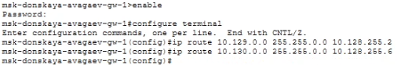{#fig-012 width=70%}

### Маршрутизатор msk-q42-avagaev-gw-1

```
enable
configure terminal

ip route 0.0.0.0 0.0.0.0 10.128.255.1
```

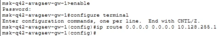{#fig-013 width=70%}

### Маршрутизатор sch-sochi-avagaev-gw-1

```
enable
configure terminal

ip route 0.0.0.0 0.0.0.0 10.128.255.5
```

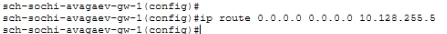{#fig-014 width=70%}

## Настройка маршрутизации на 42 квартале

### Маршрутизатор msk-q42-avagaev-gw-1

```
enable
configure terminal

ip route 10.129.128.0 255.255.128.0 10.129.1.2
```

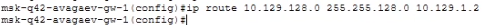{#fig-015 width=70%}

### Маршрутизирующий коммутатор msk-hostel-avagaev-gw-1

```
enable
configure terminal

ip routing

ip route 0.0.0.0 0.0.0.0 10.129.1.1
```

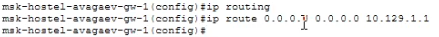{#fig-016 width=70%}

## Настрока NAT на маршрутизаторе msk-donskaya-avagaev-gw-1

```
enable
configure terminal

interface f0/1.5
ip nat inside
exit

interface f0/1.6
ip nat inside
exit

ip access-list- extended nat-inet
remark q42
permit ip host 10.129.0.200 any
permit ip host 10.129.128.200 any
remark sochi
permit ip host 10.130.0.200 any
exit
```

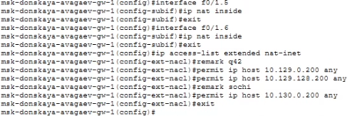{#fig-017 width=70%}

# Выводы

Я настроил взаимодействие через сеть провайдера посредством статической 
маршрутизации локальной сети.
